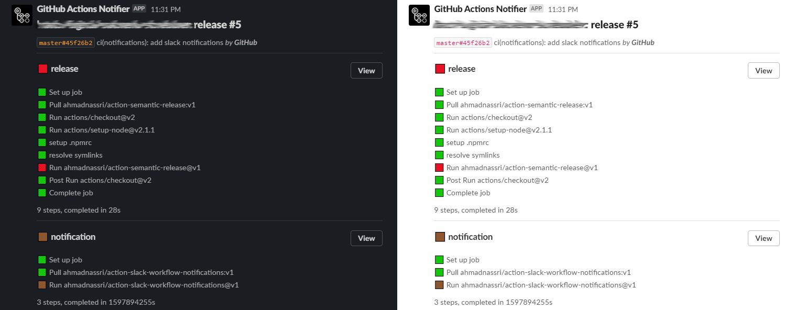

# GitHub Action: GitHub Slack Workflow Notifications

[![license][license-img]][license-url]
[![version][version-img]][version-url]
[![super linter][super-linter-img]][super-linter-url]
[![release][release-img]][release-url]

[license-url]: LICENSE
[license-img]: https://badgen.net/github/license/ahmadnassri/action-slack-workflow-notifications

[version-url]: https://github.com/ahmadnassri/action-slack-workflow-notifications/releases
[version-img]: https://badgen.net//github/release/ahmadnassri/action-slack-workflow-notifications

[super-linter-url]: https://github.com/ahmadnassri/action-slack-workflow-notifications/actions?query=workflow%3Asuper-linter
[super-linter-img]: https://github.com/ahmadnassri/action-slack-workflow-notifications/workflows/super-linter/badge.svg

[release-url]: https://github.com/ahmadnassri/action-slack-workflow-notifications/actions?query=workflow%3Arelease
[release-img]: https://github.com/ahmadnassri/action-slack-workflow-notifications/workflows/release/badge.svg

Fully detailed GitHub Actions workflow notifications in Slack



## Usage

```yaml
on:
  pull_request:

jobs:
  # run as many jobs as you want
  a-job:
    runs-on: ubuntu-latest

    steps:
      # run as many steps as you need
      - uses: actions/checkout@v2
      - uses: actions/checkout@v2
      - uses: actions/setup-node@v1
      - run: npm install
      - run: npm test

  # include one last job
  slack:
    if: ${{ always() }} # ensure this job always runs
    needs: [ a-job, ... ] # indicate which jobs you want to wait for
    runs-on: ubuntu-latest
    steps:
      - uses: ahmadnassri/action-slack-workflow-notifications@v1
        with:
          slack-webhook: https://hooks.slack.com/services/...
```

### Inputs

| input            | required | default        | description                                                     |
| ---------------- | -------- | -------------- | --------------------------------------------------------------- |
| `slack-webhook`  | ✔        | `-`            | A Slack [Webhook URL](https://api.slack.com/messaging/webhooks) |
| `github-token`   | ❌       | `github.token` | The GitHub token used to update the pull-request                |
